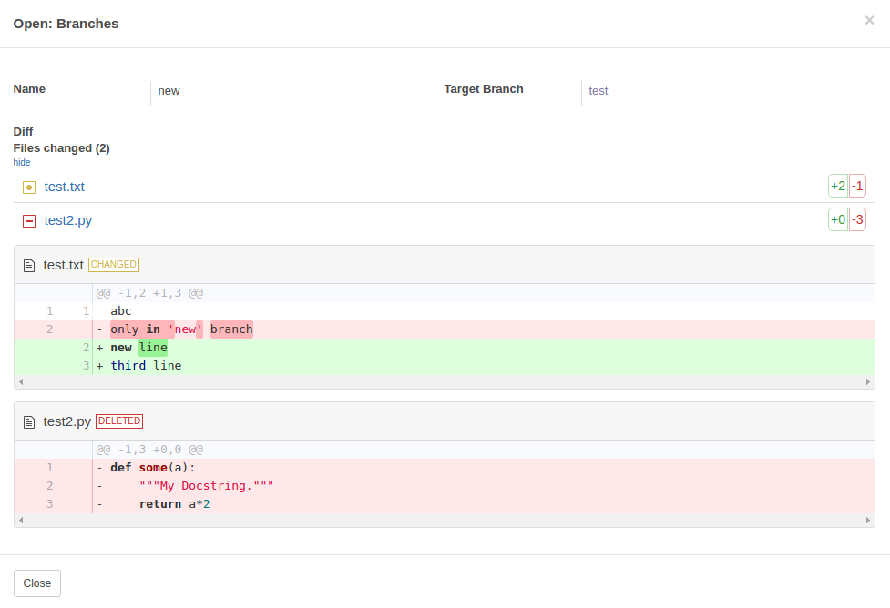

Diff To HTML
============

Converts diff output of a field value to prettified HTML.
(e.g. as seen on github, bitbucket etc.).

This module uses `diff2html`_ as a base library to generate HTML diff.

Usage:

* Field must be of `HTML` type.
* Set :code:`widget="diff2html"` on field where it is defined in a form view.
* You can provide optional configuration from XML view (on field). For example:

.. code-block::

    <field name="diff"
        widget="diff2html" data-diff2html="{'options': {'inputFormat': 'diff', 'showFiles': true}, 'extra': {'highlightCode': true, 'fileListCloseable': true, 'fileListCloseableDefault': true}}"/>

* There are two config parts: :code:`options` and :code:`extra`. For all `options` and what they do, look `here`_. For :code:`extra` part, there are currently two implementations: :code:`highlightCode` and :code:`fileListCloseable` (with optional key :code:`fileListCloseableDefault` to specify if files are hidden or showed on default.). If you need some additional effect on HTML output that diff2html library provides, then you need to extend function :code:`apply_extra`.

*This a sample diff2html implementation in Odoo using this widget:*

Contributors
------------

* Andrius Laukavičius

.. _diff2html: https://github.com/rtfpessoa/diff2html
.. _here: https://github.com/rtfpessoa/diff2html#configuration
